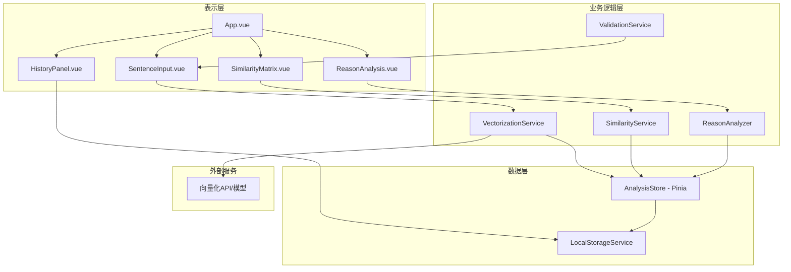

# 设计文档

## 概述

句子向量相关性分析平台是一个基于Vue.js 3的单页应用（SPA），采用组合式API（Composition API）构建。系统架构分为三个主要层次：

1. **表示层（Presentation Layer）**: Vue.js组件，负责用户界面和交互
2. **业务逻辑层（Business Logic Layer）**: 服务类和工具函数，处理向量化、相似度计算和原因分析
3. **数据层（Data Layer）**: 本地存储管理和状态管理（Pinia）

系统采用前端向量化方案，使用预训练的轻量级模型（如Universal Sentence Encoder的JavaScript版本或通过API调用的方式）来实现句子向量化。

## 架构

### 系统架构图



### 技术栈

- **前端框架**: Vue.js 3 (Composition API)
- **状态管理**: Pinia
- **UI组件库**: Element Plus 或 Vuetify
- **图表可视化**: Chart.js 或 D3.js
- **向量化方案**: 
  - 选项1: TensorFlow.js + Universal Sentence Encoder
  - 选项2: 调用外部API（如OpenAI Embeddings API、Cohere API）
- **HTTP客户端**: Axios（如使用API方案）
- **构建工具**: Vite
- **样式**: Tailwind CSS 或 SCSS

## 组件和接口

### 1. 表示层组件

#### 1.1 App.vue
主应用组件，负责整体布局和路由管理。

**职责**:
- 管理应用的整体布局
- 协调各子组件的交互
- 处理全局错误

**接口**:
```typescript
// 无特定props，作为根组件
```

#### 1.2 SentenceInput.vue
句子输入组件，允许用户输入多个句子。

**职责**:
- 渲染句子输入表单
- 验证用户输入
- 触发分析流程

**接口**:
```typescript
interface Props {
  maxSentences?: number; // 默认10
  minSentences?: number; // 默认2
}

interface Emits {
  (e: 'submit', sentences: string[]): void;
  (e: 'validate', isValid: boolean): void;
}
```

#### 1.3 SimilarityMatrix.vue
相似度矩阵展示组件，以热力图形式显示结果。

**职责**:
- 渲染相似度矩阵
- 提供交互式热力图
- 处理用户点击选择句子对

**接口**:
```typescript
interface Props {
  sentences: string[];
  similarityMatrix: number[][];
  loading?: boolean;
}

interface Emits {
  (e: 'selectPair', pair: { index1: number; index2: number }): void;
}
```

#### 1.4 ReasonAnalysis.vue
原因分析展示组件，显示相似度的解释。

**职责**:
- 展示选中句子对的详细信息
- 显示相似度原因分析
- 高亮关键词和短语

**接口**:
```typescript
interface Props {
  sentence1: string;
  sentence2: string;
  similarity: number;
  reasons: Reason[];
}

interface Reason {
  type: 'common_keywords' | 'semantic_similarity' | 'topic_match' | 'difference';
  description: string;
  keywords?: string[];
  confidence?: number;
}
```

#### 1.5 HistoryPanel.vue
历史记录面板组件。

**职责**:
- 显示分析历史列表
- 允许用户加载历史记录
- 提供删除历史功能

**接口**:
```typescript
interface Props {
  history: AnalysisRecord[];
}

interface Emits {
  (e: 'load', record: AnalysisRecord): void;
  (e: 'delete', id: string): void;
}

interface AnalysisRecord {
  id: string;
  timestamp: number;
  sentences: string[];
  similarityMatrix: number[][];
}
```

### 2. 业务逻辑层服务

#### 2.1 VectorizationService
负责将句子转换为向量。

**接口**:
```typescript
class VectorizationService {
  /**
   * 将句子数组转换为向量数组
   * @param sentences - 输入句子数组
   * @returns Promise<向量数组>
   * @throws VectorizationError 当向量化失败时
   */
  async vectorize(sentences: string[]): Promise<number[][]>;
  
  /**
   * 初始化向量化模型或API连接
   */
  async initialize(): Promise<void>;
  
  /**
   * 检查服务是否已就绪
   */
  isReady(): boolean;
}
```

#### 2.2 SimilarityService
负责计算向量之间的相似度。

**接口**:
```typescript
class SimilarityService {
  /**
   * 计算两个向量的余弦相似度
   * @param vector1 - 第一个向量
   * @param vector2 - 第二个向量
   * @returns 相似度分数 [-1, 1]
   */
  cosineSimilarity(vector1: number[], vector2: number[]): number;
  
  /**
   * 计算所有向量对的相似度矩阵
   * @param vectors - 向量数组
   * @returns N×N相似度矩阵
   */
  computeSimilarityMatrix(vectors: number[][]): number[][];
  
  /**
   * 归一化相似度分数到[0, 1]范围
   * @param score - 原始相似度分数
   * @returns 归一化后的分数
   */
  normalizeSimilarity(score: number): number;
}
```

#### 2.3 ReasonAnalyzer
负责分析相似度的原因。

**接口**:
```typescript
class ReasonAnalyzer {
  /**
   * 分析两个句子的相似度原因
   * @param sentence1 - 第一个句子
   * @param sentence2 - 第二个句子
   * @param similarity - 相似度分数
   * @param vector1 - 第一个句子的向量
   * @param vector2 - 第二个句子的向量
   * @returns 原因列表
   */
  analyze(
    sentence1: string,
    sentence2: string,
    similarity: number,
    vector1: number[],
    vector2: number[]
  ): Reason[];
  
  /**
   * 提取句子中的关键词
   * @param sentence - 输入句子
   * @returns 关键词数组
   */
  extractKeywords(sentence: string): string[];
  
  /**
   * 找出两个句子的共同关键词
   * @param keywords1 - 第一个句子的关键词
   * @param keywords2 - 第二个句子的关键词
   * @returns 共同关键词数组
   */
  findCommonKeywords(keywords1: string[], keywords2: string[]): string[];
}
```

#### 2.4 ValidationService
负责输入验证。

**接口**:
```typescript
class ValidationService {
  /**
   * 验证句子是否有效
   * @param sentence - 输入句子
   * @returns 验证结果
   */
  validateSentence(sentence: string): ValidationResult;
  
  /**
   * 验证句子数组
   * @param sentences - 句子数组
   * @param minCount - 最小句子数
   * @param maxCount - 最大句子数
   * @returns 验证结果
   */
  validateSentences(
    sentences: string[],
    minCount: number,
    maxCount: number
  ): ValidationResult;
}

interface ValidationResult {
  isValid: boolean;
  errors: string[];
}
```

### 3. 数据层

#### 3.1 AnalysisStore (Pinia)
全局状态管理。

**接口**:
```typescript
interface AnalysisState {
  sentences: string[];
  vectors: number[][];
  similarityMatrix: number[][];
  selectedPair: { index1: number; index2: number } | null;
  loading: boolean;
  error: string | null;
  history: AnalysisRecord[];
}

interface AnalysisStore {
  // State
  state: AnalysisState;
  
  // Getters
  selectedSentences: ComputedRef<{ sentence1: string; sentence2: string } | null>;
  selectedSimilarity: ComputedRef<number | null>;
  
  // Actions
  setSentences(sentences: string[]): void;
  setVectors(vectors: number[][]): void;
  setSimilarityMatrix(matrix: number[][]): void;
  selectPair(index1: number, index2: number): void;
  setLoading(loading: boolean): void;
  setError(error: string | null): void;
  addToHistory(record: AnalysisRecord): void;
  loadFromHistory(record: AnalysisRecord): void;
  deleteFromHistory(id: string): void;
  clearAnalysis(): void;
}
```

#### 3.2 LocalStorageService
本地存储管理。

**接口**:
```typescript
class LocalStorageService {
  private readonly STORAGE_KEY = 'sentence_similarity_history';
  private readonly MAX_RECORDS = 10;
  
  /**
   * 保存分析记录
   * @param record - 分析记录
   */
  saveRecord(record: AnalysisRecord): void;
  
  /**
   * 获取所有历史记录
   * @returns 历史记录数组
   */
  getRecords(): AnalysisRecord[];
  
  /**
   * 删除指定记录
   * @param id - 记录ID
   */
  deleteRecord(id: string): void;
  
  /**
   * 清空所有记录
   */
  clearAll(): void;
}
```

## 数据模型

### 核心数据结构

```typescript
// 句子向量
interface SentenceVector {
  sentence: string;
  vector: number[];
  timestamp: number;
}

// 相似度对
interface SimilarityPair {
  index1: number;
  index2: number;
  sentence1: string;
  sentence2: string;
  similarity: number;
}

// 分析记录
interface AnalysisRecord {
  id: string;
  timestamp: number;
  sentences: string[];
  vectors: number[][];
  similarityMatrix: number[][];
}

// 原因类型
interface Reason {
  type: 'common_keywords' | 'semantic_similarity' | 'topic_match' | 'difference';
  description: string;
  keywords?: string[];
  confidence?: number;
}

// 导出数据格式
interface ExportData {
  version: string;
  timestamp: number;
  sentences: string[];
  similarities: {
    sentence1: string;
    sentence2: string;
    similarity: number;
  }[];
}
```

## 正确性属性

*正确性属性是应该在系统所有有效执行中保持为真的特征或行为——本质上是关于系统应该做什么的形式化陈述。属性作为人类可读规范和机器可验证正确性保证之间的桥梁。*

